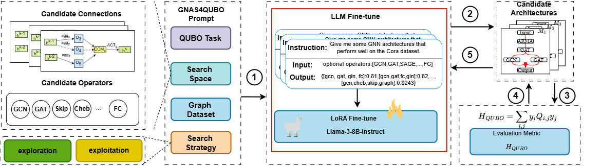

# Large Language Models Enhanced Graph NeuralArchitecture Search for Quadratic Unconstrained Binary Optimization

## Overview
In this paper, we propose GNAS4QUBO, the core idea of our method is
to use LLMs to generate new GNNs that best fit a given QUBO
problem.

An overview of the proposed GNAS4QUBO method. The framework includes five steps. 1 Design a set of GNAS4QUBO
prompts to describe the QUBO task, dataset, search space and search strategy; 2 Based on the prompts, a batch of candidate archi-
tectures are generated by fine-tuned LLMs. 3 Encode a QUBO problem as a graph and train the generated graph neural networks,
where the QUBO is used as the metric for GNN evaluation; 4 Design feedback prompts based on the model evaluation result
H; and 5 Update the GNAS4QUBO prompts and generate new GNN architectures. This way, GNAS4QUBO will iteratively update
the generated GNN architectures and output the best architectures of the given QUBO problem.

## Environments
 
Versions of PyTorch, numpy, scipy, sklearn, torch_geometric and networkx are required. Ensure that PyTorch 1.1.0 and CUDA 9.0 are installed. Then run, please note we have provided a `requirements.txt` file, which defines the environment required to run this code.

pip install torch==1.1.0 -f https://download.pytorch.org/whl/cu90/torch_stable.html

pip install -r requirements.txt

## Code Execution

To solve maxcut and mis problems, run

> python -m for_CO_exp.main

### Results on Maxcut
| Dataset | G14  | G15  |  G22  | G49  | G50  |  G55  |  G55 |
|:-------:|:----:|:----:|:-----:|:----:|:----:|:-----:|-----:|
|   BLS   | 3064 | 3050 | 13359 | 6000 | 5880 | 10294 | 9541 |
|  DSDP   | 2922 | 2938 | 12960 | 6000 | 5880 | 9960  | 9456 |
|  KHLWG  | 3061 | 3050 | 13359 | 6000 | 5880 | 10236 | 9438 |
| RUN_CSP | 2943 | 2928 | 13028 | 6000 | 5880 | 10116 |   —— |
| PI-GNN  | 3026 | 2990 | 13181 | 5918 | 5820 | 10138 | 9421 |
| GNAS4CO | 3050 | 2996 | 13217 | 6000 | 5880 | 10146 | 9459 |

> for_CO_exp.co_corefunc.py --is_max_cut=False python -m for_CO_exp.main
### Results on MIS
| Dataset |  acc@1   |   acc@5   |  acc@10  | 
|:-------:|:--------:|:---------:|:--------:|
|  TREES  | 30.9±0.4 | 47.4±0.3  | 54.6±0.3 | 
| SVMRANK | 48.0±0.6 | 69.3±0.2  | 78.1±0.2 | 
|  LMART  | 48.9±0.3 | 68.9±0.4  | 77.0±0.5 |
|  GCNN   | 56.5±0.2 | 80.08±0.3 | 89.0±0.1 | 
| GNAS4CO | 58.1±0.3 | 84.0±0.3  | 90.1±0.2 | 

### Results on Set Covering
| Dataset |  acc@1   |   acc@5   |  acc@10  | 
|:-------:|:--------:|:---------:|:--------:|
|  TREES  | 51.8±0.3 | 80.5±0.1  | 91.4±0.2 | 
| SVMRANK | 57.6±0.2 | 84.7±0.1  | 94.5±0.1 | 
|  LMART  | 57.4±0.2 | 84.5±0.1  | 93.8±0.1 |
|  GCNN   | 65.5±0.1 | 92.4±0.1  | 98.2±0.0 | 
| GNAS4CO | 67.3±0.3 | 92.8±0.1  | 98.8±0.0 | 

### Results on Combinatorial Auction
| Dataset |  acc@1   |   acc@5   |  acc@10  | 
|:-------:|:--------:|:---------:|:--------:|
|  TREES  | 52.9±0.3 | 83.4±0.1  | 94.1±0.1 | 
| SVMRANK | 57.2±0.2 | 86.9±0.2  | 95.4±0.1 | 
|  LMART  | 57.3±0.3 | 86.9±0.2  | 95.3±0.1 |
|  GCNN   | 61.6±0.1 | 91.0±0.1  | 97.8±0.1 | 
| GNAS4CO | 62.0±0.2 | 92.0±0.2  | 97.8±0.3 | 

### Results on Faclicity Location
| Dataset |  acc@1   |   acc@5   |  acc@10  | 
|:-------:|:--------:|:---------:|:--------:|
|  TREES  | 63.0±0.4 | 97.3±0.1  | 99.9±0.0 | 
| SVMRANK | 67.8±0.1 | 98.1±0.1  | 99.9±0.0 | 
|  LMART  | 68.0±0.2 | 98.0±0.0  | 99.9±0.0 |
|  GCNN   | 71.2±0.2 | 98.6±0.1  | 99.9±0.0 | 
| GNAS4CO | 72.1±0.3 | 98.9±0.4  | 99.9±0.0 | 

### Results on different LLMs
#### NodeClassification

|   Models    |    Cora    | Citeseer   |   PubMed   |
|:-----------:|:----------:|:-----------|:----------:|
| ChatGLM3-6B | 81.33(267) | 69.60(480) | 72.27(207) |
|   PaLM 2    | 81.33(279) | 69.73(350) | 78.03(11)  |
| ChatGLM3-6B | 80.96(638) | 70.56(35)  | 78.03(11)  |
| ChatGLM3-6B |  83.13(1)  | 70.22(2)   |  78.30(3)  |
|  LLM4GNAS   |  80.93(5)  | 70.58(7)   | 79.87(14)  |

To use GNAS4CO generate GNN models for other dataset and to solve different tasks like node_classification, link_pred and graph_classification.
please run.
>python for_other_dataset_exp.llm4gnas.main
