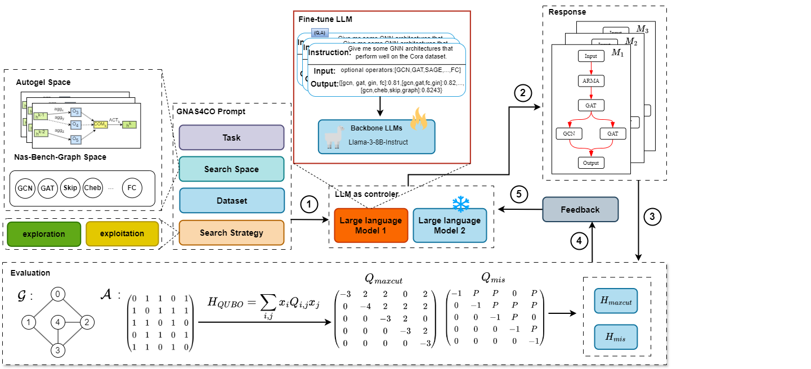

# Graph Neural Architecture Search with Large Language Models for Combinatorial Optimization

## Overview
In this paper, we propose GNAS4CO, the core idea of our method is
to use LLMs to generate new GNNs that best fit a given CO
problem.

An overview of the proposed GNAS4CO method. The framework includes five steps. 1 Design a set of GNAS4CO
prompts to describe the CO task, dataset, search space and search strategy; 2 Based on the prompts, a batch of candidate archi-
tectures are generated by fine-tuned LLMs. 3 Encode a CO problem as a graph and train the generated graph neural networks,
where the QUBO is used as the metric for GNN evaluation; 4 Design feedback prompts based on the model evaluation result
H; and 5 Update the GNAS4CO prompts and generate new GNN architectures. This way, GNAS4CO will iteratively update
the generated GNN architectures and output the best architectures of the given CO problem.

## Environments

Please note we have provided a `requirements.txt` file, which defines the environment required to run this code.
> conda create -n <environment_name>

## Code Execution

> conda activate -n <environment_name> cd for_CO_exp  python main.py

